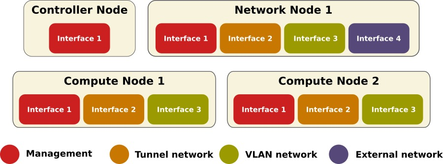
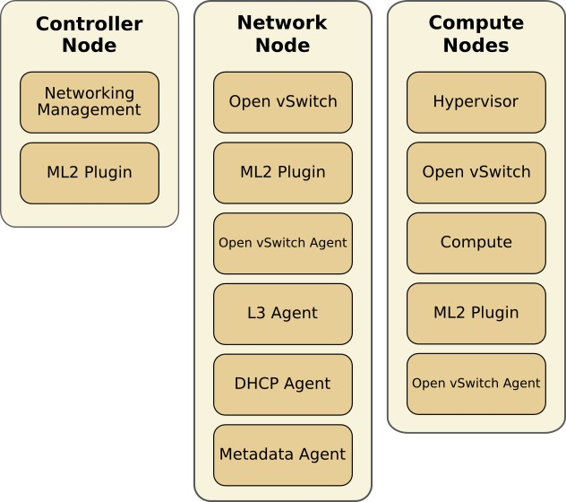

# OpenStack Network
## Using OpenStack Network

列出network agent
```
openstack network agent list [-h]  [arguments]

optional arguments:
  -h, --help            show this help message and exit
  --agent-type <agent-type>
                        List only agents with the specified agent type. The
                        supported agent types are: bgp, dhcp, open-vswitch,
                        linux-bridge, ofa, l3, loadbalancer, metering,
                        metadata, macvtap, nic.
  --host <host>         List only agents running on the specified host
  --network <network>   List agents hosting a network (name or ID)
  --router <router>     List agents hosting this router (name or ID)
  --long                List additional fields in output
```

创建网络
```
openstack network create [--share | --no-share]
                         [--enable | --disable] [--project <project>]
                         [--description <description>] [--mtu <mtu>]
                         [--project-domain <project-domain>]
                         [--availability-zone-hint <availability-zone>]
                         [--enable-port-security | --disable-port-security]
                         [--external | --internal]
                         [--default | --no-default]
                         [--qos-policy <qos-policy>]
                         [--transparent-vlan | --no-transparent-vlan]
                         [--provider-network-type <provider-network-type>]
                         [--provider-physical-network <provider-physical-network>]
                         [--provider-segment <provider-segment>]
                         [--tag <tag> | --no-tag]
                          <name>
```

创建subnet
```
openstack subnet create [--project <project>]
                        [--project-domain <project-domain>]
                        [--subnet-pool <subnet-pool> | --use-prefix-delegation USE_PREFIX_DELEGATION | --use-default-subnet-pool]
                        [--prefix-length <prefix-length>]
                        [--subnet-range <subnet-range>]
                        [--dhcp | --no-dhcp] [--gateway <gateway>]
                        [--ip-version {4,6}]
                        [--ipv6-ra-mode {dhcpv6-stateful,dhcpv6-stateless,slaac}]
                        [--ipv6-address-mode {dhcpv6-stateful,dhcpv6-stateless,slaac}]
                        [--network-segment <network-segment>] --network
                        <network> [--description <description>]
                        [--allocation-pool start=<ip-address>,end=<ip-address>]
                        [--dns-nameserver <dns-nameserver>]
                        [--host-route destination=<subnet>,gateway=<ip-address>]
                        [--service-type <service-type>]
                        [--tag <tag> | --no-tag]
                        <name>
```

创建router
```
openstack router create [--enable | --disable]
                        [--distributed | --centralized]
                        [--ha | --no-ha] [--description <description>]
                        [--project <project>]
                        [--project-domain <project-domain>]
                        [--availability-zone-hint <availability-zone>]
                        [--tag <tag> | --no-tag]
```

其他router相关操作
```
openstack router set [--name <name>] [--description <description>]
                     [--enable | --disable]
                     [--distributed | --centralized]
                     [--route destination=<subnet>,gateway=<ip-address>]
                     [--no-route] [--ha | --no-ha]
                     [--external-gateway <network>]
                     [--fixed-ip subnet=<subnet>,ip-address=<ip-address>]
                     [--enable-snat | --disable-snat] [--tag <tag>]
                     [--no-tag]

openstack router add subnet  <router> <subnet>
openstack router add port <router> <port>
openstack router remove subnet <router> <subnet>
openstack router remove port <router> <port>
```

浮动IP
```
openstack floating ip create [--subnet <subnet>]
                             [--port <port>]
                             [--floating-ip-address <ip-address>]
                             [--fixed-ip-address <ip-address>]
                             [--qos-policy <qos-policy>]
                             [--description <description>]
                             [--project <project>]
                             [--project-domain <project-domain>]
                             <network>
```

创建端口
```
openstack port create --network <network> [--description <description>]
                        [--device <device-id>]
                        [--mac-address <mac-address>]
                        [--device-owner <device-owner>]
                        [--vnic-type <vnic-type>] [--host <host-id>]
                        [--dns-name dns-name]
                        [--fixed-ip subnet=<subnet>,ip-address=<ip-address> | --no-fixed-ip]
                        [--binding-profile <binding-profile>]
                        [--enable | --disable] [--project <project>]
                        [--project-domain <project-domain>]
                        [--security-group <security-group> | --no-security-group]
                        [--qos-policy <qos-policy>]
                        [--enable-port-security | --disable-port-security]
                        [--allowed-address ip-address=<ip-address>[,mac-address=<mac-address>]]
                        [--tag <tag> | --no-tag]
                        <name>
```

## 部署Open vSwitch

网络架构


在各种角色的节点上有哪些组件
